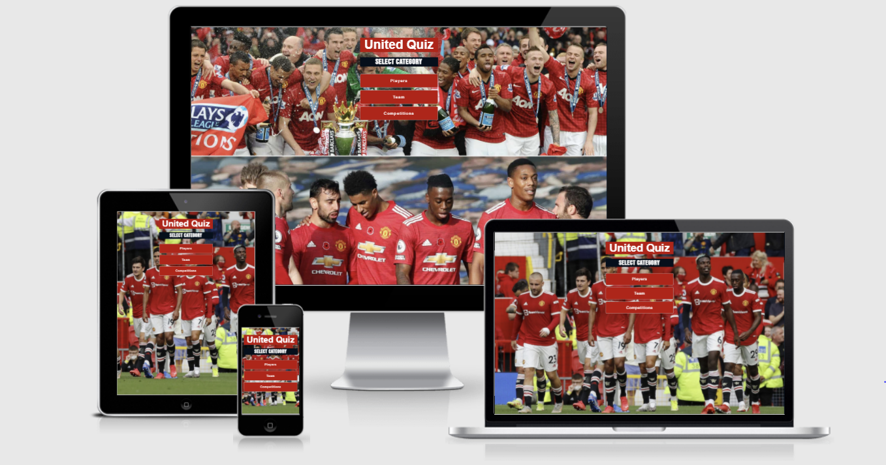
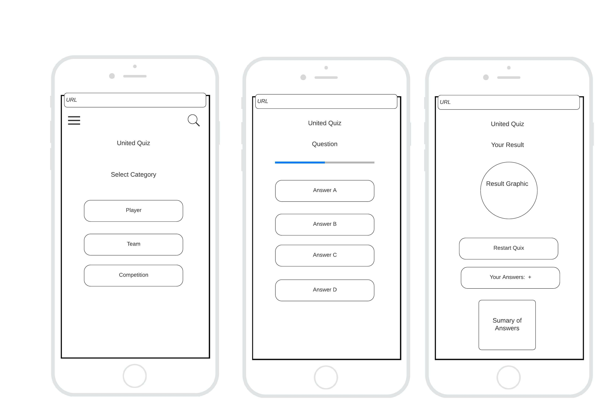
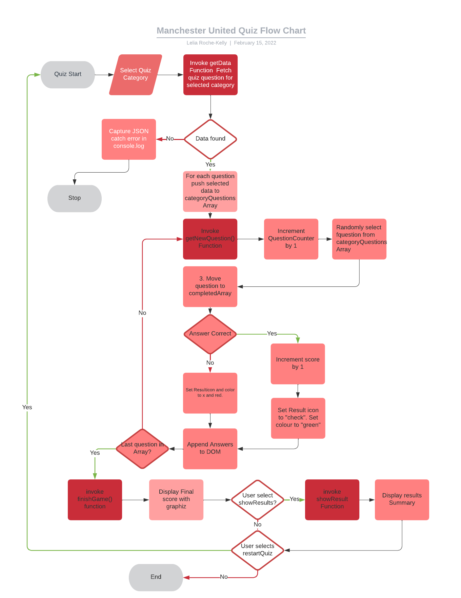

<h1>Manchester Quiz Application</h1>

<h2>Introduction</h2>

Link to site:
<a href="https://leliarkelly.github.io/ManchesterUnitedQuiz/">Manchester United Quiz</a>

The Manchester United Quiz App is a fun multiple choice quiz which tests the user's knowledge of Manchester United.

<h2>Project Goals</h2>

 Provide the user with a fun, engaging and easy to play multiple choice quiz.

 Provide some visuals with the use of images and colour to contribute to a positive user experience.

 Track progress and provide user with feedback on quiz

 Be scalable where new questions and images can be added to the JSON file without updating the underlying code 

<h2>User Stories</h2>

As a user I want:

<li>To play a fun and easy to use quiz.</li>
<li>To test my knowledge of Manchester United .</li>
<li>To get my total score and compare to the correct answers </li>
<li>To be able to easily repeat the quiz if I want to try again. </li>

As a developer I want:

<li>Easily add new questions and images to the questions array without updating the underlying code.</li>

<h2>Structure</h2>

The quiz has 3 parts:  Category section, question section and result section. 

1. Category section displays the category of questions available for Teams, Competitions and Players

2. The question section displays the questions and possibly answers for the user to answer

3. The result section provides a summary of the results back to the user

<h2>Wireframes</h2>

The wireframes depicts the design for the 3 parts of the application

<li>Home screen: display the category available: Players, Team and Competition</li>
<li>Quiz screen: presents random questions to the user.  A progress bar is displayed to allow user to see many questions they have left to complete</li>
<li>Result screen: display the player's score out of number with a graphical doughnut.  The user can check their answers and also restart the game</li>

<h2>Flowchart</h2>

The flowchart below depicts the logic underpinning the JavasSript code that I developed.

<h2>Design</h2>

I used the colour and fonts designed used by the Manchester Website.

I was inspired by Manchester United website own quiz application

I enjoyed developing and learning how to implement an animated doughnut from ChartJS

<h2>Technologies/frameworks Used</h2>

<li>HTML</li>
<li>CSS</li>
<li>JavaScript</li>
<li>chartJS</li>
<li>font Awesome</li>
<li>google fonts</li>
<li>fluidCHart.com</li>

<h2>Testing</h2>

<li>During development I continuously user tested. I extensively used console.log to help me understand what my code was doing and correct error</li>
<li>I used Chrome Developer Tools to test out how the website rendered on different devices</li>
<li>I recruited some testers to test my application on different devices</li>
<li>I carried out testing on different devices.</li>
<li>I code checked on JSHINT which returned 2 errors at 175 and 177 for undefined chart variables.</li>
<li>I validated the mark-up and CSS code using: W3C Validator and Jigsaw Validator which, after corrections returned no errors</li>

<h2>User Story Testing</h2>

As a user I want:

<li>To play a fun and easy to use quiz: User feedback said it was very easy for the user with no issues reported </li>
<li>To test my knowledge of Manchester United:  A good range of questions were offered which challenged the user</li>
<li>To get my total score and compare to the correct answers:  User were easily able to check their answers at the end of the game.</li>
<li>To be able to easily repeat the quiz if I want to try again.  User were easily able to try again at the end of the game</li>

As a developer I want:

<li>Easily add new questions and images to the questions array without updating the underlying code.</li>

<h3>Instructions</h3>:

1. Download images and save into images folder
2. Open quiz.json and find question you want add image to
3. Add a key value pair of "image" : "nameoffile" to question object

<h3> Deployment</h3>

The project was deployed to GitHub with the following steps:

1. Log in to GitHub and locate the GitHub Repository
2. Select your profile from the upper-right dropdown menu and select the proper repository.
3. Select Settings and Scroll down until you locate the "GitHub Pages" Section.
4. Under "Source", click the dropdown and select "Master Branch".
5. The page will automatically refresh.
6. Scroll back down through the page to locate the now published site link in the "GitHub Pages" section.

<h3>Making a Local Clone</h3>

1. I Logged in to GitHub and located the GitHub Repository
2. Under the repository name, clicked "Clone".
3. I cloned the repository using HTTPS and GitHub Desktop
4. On GitHub Desktop I changed the directory to the location where I wanted the cloned directory to be made.
5. Press enter.
    It downloaded a copy of my repository.

<h2>Acknowledgments</h2>

1. Ideas and design of quiz application came from Manchester United Official website
2. Structure of game and initial coding ideas came from "How to Build a quiz App" from James Quick, Developer and Teacher.
3. I also used tips provided by Brad Travesy, Online teacher at Udemy
4. My Mentor at the Code institute gave much needed support, tips and encouragement throughout the development process so thank you to Spencer Barriball.

